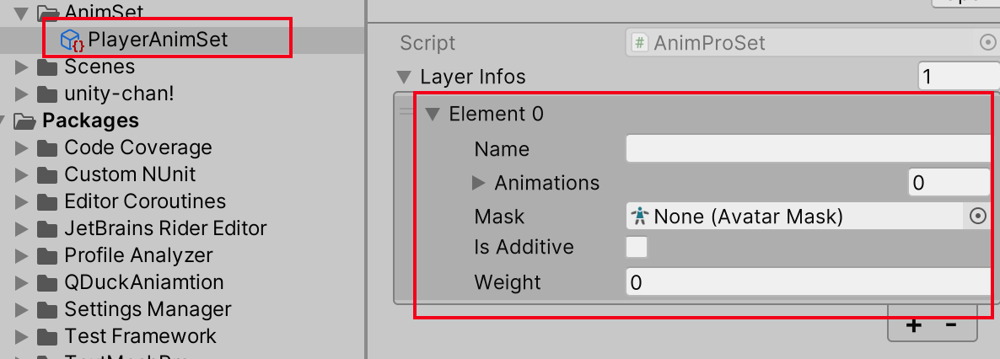

# QDuckAnimation
Based on Unity PlayableApi

### 挂载 AnimPro/AnimLite

- AnimProSetAsset/AnimLiteSetAsset 将创建的ScriptableConfig配置文件，拖入到该选项
- IsImmediatePlay 是否立即播放，勾选后物体显示后会立即显示DefaultAnimationName的动画
- DefaultAnimationName 默认动画名

### 创建 AnimSet Config

### 配置AnimSet

AnimPro支持分层动画，适合角色等或需要分层的复杂动画  AnimLite 没有分层，适合UI或者只需要单层需求的动画

- Name 当前动画层的名字（可填可不填）

- Animations 各个动画的配置

- Mask 配置AvatarMask 动画遮罩

- IsAdditve （参见unity的文档）

- Weight 权重（参见unity的文档）

  

