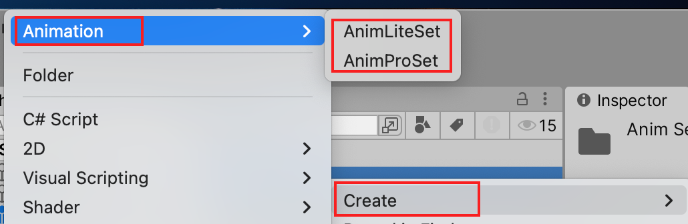

# QDuckAnimation
Based on Unity PlayableApi

可视化面板

https://github.com/Unity-Technologies/graph-visualizer.git

### 拉取方式

https://github.com/QDuckGame/QDuckAnimation.git

### 挂载 AnimPro/AnimLite

- AnimProSetAsset/AnimLiteSetAsset 将创建的ScriptableConfig配置文件，拖入到该选项
- IsImmediatePlay 是否立即播放，勾选后物体显示后会立即显示DefaultAnimationName的动画
- DefaultAnimationName 默认动画名

### 创建 AnimSet Config

### 配置AnimSet

AnimPro支持分层动画，适合角色等或需要分层的复杂动画  AnimLite 没有分层，适合UI或者只需要单层需求的动画

- Name 当前动画层的名字

- Mask 配置AvatarMask 动画遮罩

- IsAdditve （参见unity的文档）

- Weight 权重（参见unity的文档）

- Animations 各个动画的配置

  
  
  ### Animation类型
  
  

#### SingleClip

播放单个动画

- Name  名字描述
- EnterTime 进入该动画的过渡时间
- Clip 播放的动画片段（一般0.5就可以）
- Loop 是否循环
- Speed 播放速度

#### Empty 

空动画

#### RandomSelector

可以随机播放多个动画

#### 1D BlendTree

一维混合树动画，经常用于根据速度变化切换WALK和RUN动画

- VariableKey 传入值的键值，类似与Animator的Float变量(这里的API为 Anim.SetFloat("Speed,1") )
- Threshold,在上面中如果VariableKey的Speed的值为0时会播放WALK,为1时会播放RUN，在中间时则会进行动画插值

#### 2D BlendTree 

和一维类似，2维动画
